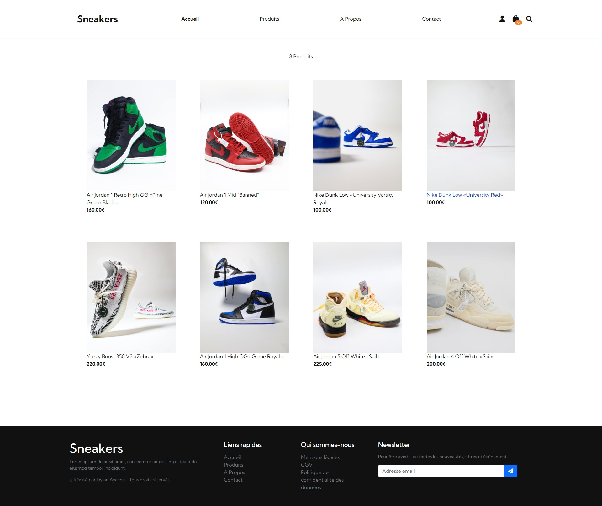

# Backend Project - Eshop App

## Welcome! 👋

Thanks for checking out this back-end personal project.

## The Project

It's a Sneakers E-Shop in PHP OOP, with a MySQL database made with phpMyAdmin in a MVC architecture.

The functionalities are :
- Checking a full page of products
- Checking a single page of product by id
- Adding to cart a product, with a size and quantity
- Having the products visited list at the bottom of each page
- Having a full recap page with the products in cart, having the possibility to manage the quantity and to see the final price

- Creating a new account in order to purchase a product
- Logging in if you already have an account
- Having the possibility to change the account's informations
- Having the possiblity to delete the account or logout

Future functionalities :
- Changing Password
- Checking previous orders
- Checkout Page
- New Categories
- Search option

Stacks used :
- PHP
- JavaScript

Css extension :
- Sass

Framework :
- Bootstrap
 
**Don't hesitate to contact me for further informations!** 🚀
